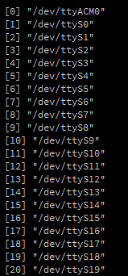
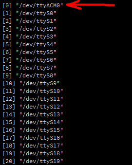
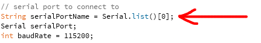

<h1 align="center">
  telemetry-interface
</h1>

<p align="center">
 <a href="#objetivo">Objetivo</a> •
 <a href="#valores-padronizados">Valores padronizados</a> • 
 <a href="#passo-a-passo">Passo-a-passo</a> • 
 <a href="#ajustes-para-o-projeto">Ajustes para o projeto</a> • 
 <a href="#avisos">Avisos</a>
</p>

# Objetivo

<p>
Como existem muitos projetos de arduino que usam a comunicação serial, este projeto foi pensado com o objetivo de analisar os dados que são enviados via serial no arduino. 

Visto que muitas vezes temos um número excessivo de dados captados na serial e mostrados no monitor serial (da IDE do arduino), acaba sendo difícil mensurar e comparar os dados entre si. Por isso, este software ao invés de mostrar os dados brutos para o usuário (como o monitor serial), utiliza gráficos de linhas em tempo real para melhor visualização dos dados.

Este projeto foi proposto principalmente para ser a interface dos dados enviados via telemetria dos foguetes da Cactus Rockets Design.
</p>

<p align="center">
  <h1 style="display: flex;">
    
  </h1>
</p>

# Valores padronizados

O programa telemetry-interface já vem com valores padrões definidos para o sitema. Estes valores devems ser posteriormente modificados para atender as especificações dos tipos de dados enviados via serial.

O arquivo TelemetryRealTimePlot.pde tem os seguintes valores definidos:

- Porta para leitura da serial: primeira porta encontrada
- Quantidade de gráficos: 4

O arquivo plotter_config.json tem definido algumas configurações também. Algumas delas são:

- "lgMinY1": "0"
- "lgMaxY1": "1024"
- "lgMinY2": "0"
- "lgMaxY2": "5"
- "lgMinY3": "0"
- "lgMaxY3": "1024"
- "lgMinY4": "0"
- "lgMaxY4": "5"

OBS.: Estas configurações descrevem os limites de valores (mínimos e máximos) para cada gráfico que será mostrado no programa.

# Passo-a-passo

- Baixe e instale a [IDE do processing](https://processing.org/download).
- Clone este repositório
```bash
$ git clone https://github.com/Daniel-Alencar/telemetry-interface
```

- Abra o arquivo TelemetryRealTimePlot.pde com a IDE do processing.
- Clique em executar (canto superior esquerdo da IDE).


# Ajustes para o projeto

Todas as adaptações serão nos arquivos TelemetryRealTimePlot.pde e plotter_config.json.

### Ajustes em TelemetryRealTimePlot.pde

Ao executar o programa pela primeira vez, teremos mais ou menos a seguinte visualização no terminal da IDE.

<p align="center">
  <h1 style="display: flex;">
    
  </h1>
</p>

Isto indica todas as portas serial que foram indentificadas em seu dispositivo.

Você deve especificar no código a porta serial que está sendo utilizada em seu arduino. Para isto:

- Veja o número do índice que aparece a esquerda da porta desejada e coloque este número para ser o índice escolhido como porta serial em que o programa irá conectar-se. Modifique o índice no valor da variável String serialPortName.

Exemplo: Especificar a porta serial "/dev/ttyACM0" no código.

Observe que esta porta está no índice 0.

<p align="center">
  <h1 style="display: flex;">
    
  </h1>
</p>

Assim, no código, especificamos o índice 0.

<p>
  <h1 style="display: flex;">
    
  </h1>
</p>

OBS.: Observe acima que também é possível mudar a taxa de baud, caso esta taxa esteja diferente da taxa do código do arduino.

É possível também modificar os labels dos gráficos para atender a ordem e os tipos de dados enviados pela serial.

Esta mudança é feita dentro da função setChartSettings(). 

Por exemplo, pode-se mudar o título do gráfico, o label do eixo X e o label do eixo Y mudando as strings marcadas em vermelho a seguir.

<p align="center">
  <h1 style="display: flex;">
    
  </h1>
</p>

OBS.: As alterações da imagem acima afetam somente o gráfico 01. Configurações semelhantes estão logo abaixo na mesma função para alterar os valores dos outros gráficos.

### Ajustes em plotter_config.json

É nesse arquivo que alteramos os valores mínimos e máximos de cada gráfico. Para fazer isto, modificamos as seguintes chaves:

- "lgMinY1"
- "lgMaxY1"
- "lgMinY2"
- "lgMaxY2"
- "lgMinY3"
- "lgMaxY3"
- "lgMinY4"
- "lgMaxY4"

Sendo que "lgMinY1" e "lgMaxY1" definem respectivamente os valores mínimo e máximo para o gráfico 01. Uma lógica semelhante é usada para modificar os valores limites dos outros gráficos.

OBS.: Os valores devem ser colocados como strings.

# Avisos
1. O programa não exibirá os gráficos se não for possível se conectar com a porta serial correta.
2. Até agora, o programa trabalha somente com quatro gráficos, ou seja, só podem haver quatro dados da serial para que estes sejam exibidos no programa.
3. O padrão de escrita na serial segue o padrão CSV. Exemplo:
- 1022,4.990,1022,4.990
- 1022,4.990,1022,4.990
- 1022,4.990,1022,4.990
